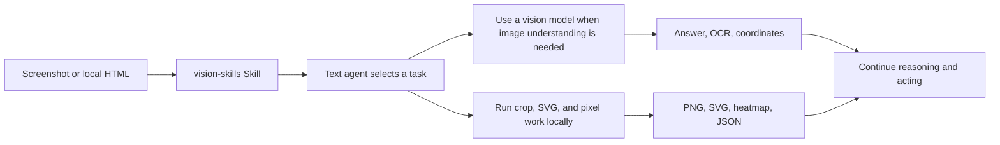

<p align="center">
  
</p>

<div align="center">

# DSH Vision Toolkit

[](LICENSE)
[](cordis.patch.yml)

> **fork:** this is [GofMan5/dsh-vision-toolkit](https://github.com/GofMan5/dsh-vision-toolkit), a fork of [Anionex/dsh-vision-toolkit](https://github.com/Anionex/dsh-vision-toolkit) (upstream 0.1.46) that turns the vision model into a **relay-backed, capability-aware choice** — pick models straight from your OpenAI-compatible relay and declare per model whether it accepts images, video, audio, and documents. Everything below still applies; the fork additions are summarized first.

**A more powerful vision toolkit—give text-only models in DeepSeek Harness eyes: image Q&A, long-screenshot OCR, UI restoration, and GUI visual tasks in one toolkit and Skill.**

🚀 Paste an image and ask directly | Install with one command | Broad use cases

[Highlights](#highlights) | [What this fork adds](#what-this-fork-adds) | [Quick start](#quick-start-three-steps) | [Toolbox](#toolbox) | [Configuration and limits](#configuration-and-limits) | [Troubleshooting](#troubleshooting) | [Development](#development)

🌐 **English** | [中文](README.zh.md)

</div>

## What this fork adds

- **Model picker from the relay.** In Settings → Vision service, press **Load models**: the plugin queries `GET {baseUrl}/models` with your saved credential (OpenAI- and Anthropic-shaped responses are parsed, de-duplicated, capped at 500), and offers the catalog as a dropdown next to the model field. It uses the in-progress form values, so it works before the first save; every entry is annotated with its detected modalities.
- **Per-model capability matrix.** Checkboxes for **Images / Video / Audio / Documents** describe what the selected vision model accepts. Heuristic name-based defaults prefill them (Qwen-Max 0902+ and omni models → all four; `*-vl` families → image+video; Claude → image+PDF; Gemini → all four; text tiers like `qwen-turbo`, `glm-*`, `deepseek-*` → none; image-generation models like `qwen-image-*` → none). Toggles that match the detected default are dropped, so the stored map only keeps real deviations; *Reset to detected* restores the heuristic.
- **Multimodal `vision_glance`.** The glance tool now accepts video (`.mp4/.webm/.mkv/.mov/.avi/.m4v/.3gp`), audio (`.mp3/.wav/.m4a/.aac/.ogg/.opus/.flac`), and documents (`.pdf/.docx/.xlsx/.pptx/.doc/.xls/.ppt`) next to images, bounded by a configurable `maxMediaBytes` (default 32 MiB). Inputs are routed to protocol-appropriate content parts:
  - **OpenAI Chat Completions** — `image_url`, `video_url` (Qwen/DashScope-compatible), `input_audio`, and the `file` part for documents;
  - **OpenAI Responses** — `input_image` and `input_file`;
  - **Anthropic Messages** — image and PDF `document` blocks.

  Non-image inputs appear in the tool result as a `media` array (kind, media type, bytes).
- **Capability gating with actionable errors.** When the model does not accept a modality, glance refuses *before any bytes move* — once in the TypeScript runtime and again in the Python client via the new `VISION_MODALITIES` env var — with a message that points at the Settings matrix. Switching the vision model degrades predictably: the same `vision_glance` call works on a fully multimodal Qwen and fails loudly on a text-only model instead of returning an opaque provider error.
- **How chat-side media reaches the model.** DSH's host attachment contract stays text+image; video, audio, and document attachments keep arriving as durable file handles with workspace paths, so a text-only chat model sees the path and calls `vision_glance` on it — which now works because the *vision* model accepts the modality. The existing paste takeover and image-input variants are unchanged.

> **External runtime mode note:** the vendored `agent-vision-toolkit` snapshot carries the fork's multimodal content-part changes and its `UPSTREAM_MANIFEST.json` was regenerated, so `runtime.mode: external` requires an exact export of this fork's `vendor/agent-vision-toolkit` directory (a clean checkout of upstream no longer matches). Managed mode — the default — is unaffected.

## Highlights

- **Paste an image and ask directly.** In DSH Web, pasting an image switches the text-only model to its `(Vision Toolkit)` variant automatically — no manual path copying or model changes. Native thumbnails, session history, and workspace paths stay intact; Web can preview artifacts.
- **One command to install.** After installation, configure a vision provider in **Settings → Vision Toolkit** and start using the tools.
- **Not just a caption — the content that matters.** The model does not produce a generic description; it extracts evidence around the current task, such as “Where is the error?” or “Where is the button?”.
- **A battle-tested visual-task methodology.** The bundled Skill tells the agent what to look at for different visual tasks, which tool to choose, how to proceed, and how to verify the result.

[`agent-vision-toolkit`](https://github.com/Anionex/agent-vision-toolkit) gives an agent more than image captions: it can read, locate, crop, trace, rebuild, and verify visual work. DSH Vision Toolkit is its native DeepSeek Harness integration, bringing that workflow into Web and Headless Profiles.

This project has two layers:

1. **Visual tools and a Skill:** the agent learns when to inspect, ground, OCR, crop, trace, or compare pixels.
2. **Native DSH integration:** those capabilities live inside Profiles, sessions, Settings, Artifacts, and the Web UI.

```sh
dsh plugin --profile web add github:GofMan5/dsh-vision-toolkit
```

**Upstream toolkit:** [Anionex/agent-vision-toolkit](https://github.com/Anionex/agent-vision-toolkit)

**Contents**

- [Highlights](#highlights)
- [Recent updates](#recent-updates)
- [Who it is for](#who-it-is-for)
- [See it in action](#see-it-in-action)
- [Quick start: three steps](#quick-start-three-steps)
- [Toolbox](#toolbox)
- [Configuration and limits](#configuration-and-limits)
- [Troubleshooting](#troubleshooting)
- [Development](#development)

## Recent updates

- **fork 0.2.0 · Relay model picker + capability matrix:** Settings can load the model catalog from the relay (`GET /models`), every model carries detected input modalities, and per-model overrides declare what it accepts. `vision_glance` now takes video, audio, and document files alongside images and routes them to `video_url` / `input_audio` / `file` (or `input_file` / Anthropic document) content parts; unsupported modalities fail with an actionable error before any bytes are sent.
- **2026-08-19 · Transparent routing by default:** The model selector keeps one entry per model with the original name, and image input (paste, history, `read_image`) works without manually switching to a `(Vision Toolkit)` variant. Disable “Transparent variant routing” in advanced settings → image input to restore the explicit entries.
- **2026-08-16 · Windows Python:** Added Microsoft Store Python support, fixing first-time isolated-runtime setup failures for affected Windows users.
- **2026-08-17 · Vision upgrade:** Switched the default model to Gemini 3.7 Flash and fixed Qwen/Gemini bounding-box coordinate order.
- **2026-08-16 · Image paste:** Text-only routes now switch to a `(Vision Toolkit)` variant and keep a workspace path, fixing blocked pastes and images that could not be reused later.
- **2026-08-16 · Service stability:** Expanded service capacity to reduce peak-time `429` responses.
- **2026-08-16 · Real model test:** Added a full image-request test in Settings, fixing the false confidence caused by a successful `/models` request to a model that still cannot process images.

## Who it is for

1. Want an interaction experience similar to a multimodal model: paste an image directly and ask a question or make a request.
2. Want more than image Q&A — complete more complex, high-value visual tasks such as turning a sketch into a front-end page, converting an image into HTML, or extracting chat messages from long screenshots; more scenarios are added over time.

The bundled `vision-skills` Skill carries the complete upstream playbooks, explaining when to use each workflow, in what order to call the tools, and how to verify the result:

| Playbook | What the agent learns to do |
| --- | --- |
| [Read long screenshots, chat histories, and scrolling pages](assets/skill/references/long-screenshot-ocr.md) | Find low-content cut bands, OCR each chunk in order, preserve chat speakers/timestamps/quotes, merge only duplicated overlap, and surface risky boundaries for verification |
| [Rebuild a UI from a screenshot or design](assets/skill/references/restore-ui.md) | Reuse project components and assets first, then combine code-native UI, extracted visuals, rendered screenshots, and visual comparison to align a page or component |
| [Restore an icon, logo, illustration, or other graphic](assets/skill/references/restore-graphic.md) | Extract a transparent PNG from the source image, or rebuild an editable/scalable SVG when needed, then verify shape, color, and alpha edges |
| [Turn a sketch, diagram, or whiteboard into structured code](assets/skill/references/restore-structure.md) | Recover nodes, labels, connections, and directions as editable Mermaid, Graphviz, or another structured representation |
| [Operate a GUI from screenshots](assets/skill/references/gui.md) | Locate a control, perform one action, capture the screen again, and verify the resulting state before continuing |

## See it in action

### Paste an image directly into DSH

<p align="center">
  
</p>

*Paste an image into the conversation. A text-only model can switch to its `Vision Toolkit` variant and inspect the image in the context of the user's question.*

### Screenshot to editable page

<p align="center">
  
  
</p>

> Prompt example: “(Use vision-skills) Rebuild this image into HTML.”

*Left: the reference screenshot. Right: an editable HTML/CSS result. The result can continue into screenshot rendering and pixel comparison instead of ending as an image description.*

### Sketch to working interface

<p align="center">
  
  
</p>

*Left: a hand-drawn reference. Right: the working interface reconstructed from it.*

> Prompt example: “(Use vision-skills) Turn this sketch into a working front-end page.”

### Fast UI restoration: an approximate first pass

<p align="center">
  
  
</p>

> Prompt example: “(Use vision-skills) Quickly rebuild this image into HTML.”

*Left: the original page. Right: a fast reconstruction that preserves the main layout, content, and visual hierarchy while allowing approximate colors and library icons. Fast mode targets a first screenshot in about three minutes.*

## Quick start: three steps

### 1. Install

Install **this fork** from its GitHub repository. It ships as `@gofman5/dsh-vision-toolkit` (owner: [GofMan5](https://github.com/GofMan5)), so the profile bundle list and any patch rows must use the new name after switching from upstream:

```sh
dsh plugin --profile web add github:GofMan5/dsh-vision-toolkit
```

The upstream npm release (`@anionex/dsh-vision-toolkit`, owned by Anionex) works exactly the same way, minus the fork features:

```sh
dsh plugin --profile web add @anionex/dsh-vision-toolkit
```

You can install it into a Headless Profile too:

```sh
dsh plugin --profile headless add github:GofMan5/dsh-vision-toolkit
```

Using DSH Desktop? It bundles its own `dsh` CLI and intentionally does not add it to your system PATH. Open **DSH Terminal** from the tray and run the command there, targeting the Desktop profile:

```sh
dsh plugin --profile desktop add github:GofMan5/dsh-vision-toolkit
```

Then restart DSH Desktop. The built-in plugin marketplace in DSH Desktop 2.0.1 has known installation issues; the terminal command above is the reliable path until a fixed Desktop release is available.

For the full Desktop install, update, and troubleshooting walkthrough, see [Installing and updating in DSH Desktop](docs/dsh-desktop-install.md).

### 2. Restart and check it

Restart a running Web Profile, then open **Settings → Vision Toolkit**, configure a vision provider, and run **Test vision model** to confirm it is reachable. Point the Base URL at an OpenAI-compatible relay and press **Load models** to pick the vision model from its catalog; the capability checkboxes below the model field show what it accepts (adjust them if the name-based defaults are off), then save.

The first start prepares an isolated runtime: the plugin prefers a system Python 3.11+; when none is found, it downloads a hash-verified standalone Python (about 35 MB) from the domestic mirror (`dsh-vision-python-bootstrap-1317715800.cos.ap-guangzhou.myqcloud.com`) on first use, falling back to the GitHub release when the mirror is unreachable. The locked runtime dependencies (Pillow, NumPy, vtracer) are installed from the Tencent Cloud PyPI mirror (`mirrors.cloud.tencent.com/pypi/simple`) first and fall back to the official PyPI index. A normal installation does not require an `agent-vision-toolkit` source checkout or a local path setting.

### 3. Paste an image and describe the outcome you want

Paste a screenshot into the conversation or place an image in the session workspace, then invoke `/vision-skills`. For example:

```text
Inspect this screenshot. Explain the error and tell me what to fix first.
Find the login button in the top-right corner, return original pixel coordinates, and make a boxed preview.
Crop this icon and convert it to SVG.
Rebuild the page from reference.png. After each pass, render it and run a pixel diff until the major differences are gone.
```

## Toolbox

The plugin provides 10 tools that can be called independently or composed into a workflow:

| Tool | Best question to ask | Main result |
| --- | --- | --- |
| `vision_glance` | “What is happening in this image?” | Focused answer, description, OCR, or multi-image comparison |
| `vision_ground` | “Where is the thing I need?” | Original pixel coordinates and optional boxed preview |
| `vision_detect` | “Which buttons, icons, or elements are present?” | Numbered element inventory, coordinates, and optional preview |
| `vision_crop` | “Extract this region as its own image” | PNG or JPEG crop |
| `vision_trace` | “Turn this shape into an editable vector” | SVG |
| `vision_pixel_diff` | “Where does the implementation differ from the reference?” | Difference percentage, ranked regions, heatmap, and JSON |
| `vision_long_screenshot_ocr` | “Read this entire long screenshot” | Markdown, chunks, manifest, and audit output |
| `vision_extract_foreground` | “Remove the background from this subject” | Transparent PNG |
| `vision_dominant_colors` | “Which colors dominate this area?” | Palette or ranked candidate colors |
| `vision_html_screenshot` | “Render this local page at an exact viewport or capture the full page” | PNG and optional CSS `pageHeight` |

Coordinates always use original-image pixels in `x1,y1,x2,y2` form, so grounding output can feed directly into cropping, tracing, or later automation.

For a long HTML document, pass `fullPage=true`. The requested width and height remain the layout viewport, while the resulting PNG covers the complete document and reports `pageHeight` in CSS pixels.

## How it works

The plugin keeps image understanding and deterministic local image processing in one Agent workflow. The diagram below shows the implementation boundary.

### Descriptions that keep the task in view

Most vision bridges for text-only models ask a multimodal model for a generic description and hand it to the text model, adding a semantic layer where information is lost. Vision Toolkit instead recovers **why the agent wants to look at the image**: the user message or the model's stated reason becomes a focus hint passed to the vision model. The result is a task-aware description that emphasizes what matters for the current step — with fewer tokens, higher accuracy, and faster responses.

<p align="center">
  
  
</p>

**Architecture and image-input behavior**



The visual capabilities come from a packaged, pinned `agent-vision-toolkit` snapshot. The DSH plugin handles installation, session-scoped tool exposure, Credentials, path checks, cancellation, timeouts, result files, and Web presentation. The runtime never fetches upstream `main` in the background.

The bundled `vision-skills` Skill is the DSH adapter of the upstream
`vision-tools` Skill: its `SKILL.md` plus all five upstream playbooks. Tool
names, argument syntax, Artifact delivery, progressive exposure, and DSH
path/lifecycle boundaries are adapted; the upstream tool-selection rules,
coarse-to-fine method, and task SOPs remain intact. The exact upstream Skill
commit, source hashes, adapted hashes, and reviewable adapter patch are
recorded in `assets/skill/UPSTREAM.json` and `patches/vision-tools-dsh.patch`.

For routes that DSH positively identifies as text-only, the plugin registers a sibling `<model> (Vision Toolkit)` variant. By default, pasting an image in DSH Web switches to that variant and gives the model both a reusable workspace path and a visual description focused on the current task.

## Configuration and limits

### Configure a vision model

Configure the vision provider in **Settings → Vision Toolkit** and store the API key as a DSH Credential. Settings stores the Credential reference and never reads the saved secret back into the browser.

You can also configure a Profile patch:

```yaml
- id: vision-toolkit
  config:
    provider:
      baseUrl: https://api.example.com/v1
      credential: MY_VISION_KEY
      model: your-vision-model
      protocol: openai
```

OpenAI Chat Completions-compatible endpoints, OpenAI Responses, and Anthropic Messages are supported. Existing configurations continue to use Chat Completions. To use a Responses-compatible endpoint, set `protocol: responses`; the plugin appends `/responses` to the configured base URL. An optional `reasoningEffort` is sent only for Responses requests:

```yaml
      protocol: responses
      reasoningEffort: medium
```

Leaving `reasoningEffort` blank uses the model or proxy default. Common values are `none`, `minimal`, `low`, `medium`, `high`, and `xhigh`, but the field intentionally accepts provider-specific values made from letters, digits, `.`, `_`, and `-` (up to 64 characters). Support and billing vary by model or proxy; higher effort may increase reasoning tokens, latency, and cost. The Responses request sets `store: false`, but that flag does not replace reviewing the provider's own data-retention policy. The Web Settings panel exposes the full provider, runtime, timeout, image-limit, and image-input-variant configuration.
Profile patches can also supply non-secret deployment metadata in `provider.headers`. A gateway that routes by conversation can name one or more generated headers in `provider.sessionHeaders`; OpenCode Zen, for example, requires `x-opencode-session`:

```yaml
- id: vision-toolkit
  config:
    provider:
      headers:
        x-tenant: acme
      sessionHeaders:
        - x-opencode-session
```

Static header values are ordinary plaintext Settings, not Credentials. Do not put API keys, bearer tokens, cookies, or other secrets in `provider.headers`; continue to use `provider.credential` for the vision API key. The plugin rejects client-owned authentication headers and HTTP routing/framing headers, case-insensitive duplicates, conflicts between the two fields, invalid names or values, more than 32 combined entries, names over 128 bytes, values over 4096 bytes, or more than 16384 bytes in total.

Every session header receives the first 32 hexadecimal characters of an HMAC-SHA256 value keyed with fresh process randomness. The value is stable for the same operation identity while the DSH process is running and rotates after restart. Calls with a Session use its id as the private HMAC input; only calls without one fall back to `workspace:<absolute path>`, and neither the raw Session id nor workspace path is sent. One Settings health operation uses the same derived value for `GET /models` and its real model request. Headers are injected only into URLs on the configured provider origin and beneath its base path. With both fields empty, no extra-header environment value is created and provider wire-header behavior remains unchanged.

The advanced **Default save directory** setting can place artifacts, pasted images, and caches below an absolute POSIX shared root such as `/tmp/dsh-vision-toolkit`; the plugin creates a private mode-0700 child for the current user and workspace. Leaving it blank keeps the existing workspace-local `.dsh-vision-toolkit` directory. Configured shared roots are currently rejected on Windows because their ownership and access-control lists cannot yet be verified safely.

When the configured save directory changes, the plugin retains earlier validated roots as read-only input locations. Web Profiles persist that history in the plugin-owned `vision_toolkit_storage` storage-domain sidecar, including when the active Settings provider is read-only, so existing pasted-image paths remain usable after a Profile restart. Custom Profiles should compose `@deepseek-ai/dsh-storage-domain` when they use configured shared storage.

For a trusted internal endpoint that uses a self-signed certificate or MITM proxy, start the DSH process with `VISION_SSL_VERIFY=0`. The plugin forwards that value to the isolated Python runtime; certificate verification remains enabled when the variable is unset or has any other value. The false values `false`, `off`, `no`, `none`, and `disabled` are also accepted, case-insensitively.

### Configure the Python runtime

Most users never need to configure the Python runtime: the plugin prefers a system Python 3.11+ and otherwise downloads a pinned standalone Python automatically from the domestic mirror, falling back to GitHub when the mirror is unreachable.

For advanced setups — overriding `runtime.python`, using `runtime.mode: external`, verifying the runtime, or allowing additional input directories — see [Python runtime configuration](docs/python-runtime.md).

## Troubleshooting

| Problem | What to do |
| --- | --- |
| The vision-model test fails with `Vision API returned an incompatible response structure` | The base URL usually needs a path prefix. Local OpenAI-compatible services such as LM Studio and Ollama should be entered as `http://127.0.0.1:1234/v1` (include `/v1`); the plugin appends `/chat/completions` for OpenAI Chat Completions or `/responses` for OpenAI Responses, and a port-only address may hit an unknown endpoint |
| Pasting an image still says the model does not support image input | Restart the Web Profile, refresh the page, and confirm the selected route has the `(Vision Toolkit)` suffix. You can also place the image in the session workspace and invoke `/vision-skills` |
| The vision service returns 429 | Wait for the `Retry-After` interval, or switch to your own endpoint when you need stable higher volume |
| The image exceeds a size or pixel limit | Crop or resize it first; the error identifies whether bytes or decoded pixels caused the rejection |
| A custom Credential is missing | Enter the API key in **Settings → Vision Toolkit** and confirm the Credential name matches the provider configuration |
| OpenCode Zen returns `400 MissingSessionID` | Add `x-opencode-session` to `provider.sessionHeaders` in the Profile patch, then restart the Profile; do not put a Session id or API key in `provider.headers` |
| First-time runtime setup fails | The standalone-Python download needs network and disk access (domestic mirror first, GitHub fallback). Check connectivity or package-cache access, or install Python 3.11+ / configure `runtime.python` in Settings, then retry the model test |
| Chrome is not found | Install Chrome, Chromium, or Edge. Only HTML screenshot rendering is unavailable; the other tools still work |
| DSH Desktop says `dsh` is not recognized, or its built-in marketplace install fails | Open **DSH Terminal** from the tray, run `dsh plugin --profile desktop add github:GofMan5/dsh-vision-toolkit`, then restart DSH Desktop. The Desktop 2.0.1 marketplace has known install issues, so the terminal command is the reliable path for now |
| An artifact cannot be previewed | Use **Open file** or the workspace path in the result. Preview URLs exist only while the Web route is available |

## FAQ

**How does a vision model affect costs?**

Each inspection is a separate multimodal request containing the necessary intent and image; context does not accumulate across calls. Actual cost depends on the provider, image, model, and — for Responses — `reasoningEffort`. Higher effort may consume more reasoning tokens and take longer. Leave effort blank to use the provider default, or use a locally deployed small multimodal side model (for example the Gemma 4 or Qwen 3.5/3.6 series) when predictable local cost matters.

## Development

- Read [CONTRIBUTING.md](CONTRIBUTING.md) before contributing.
- Use [GitHub Issues](https://github.com/GofMan5/dsh-vision-toolkit/issues) for bugs, focused feature requests, and usage questions.
- Report vulnerabilities privately through [SECURITY.md](SECURITY.md).
- See [CHANGELOG.md](CHANGELOG.md) for releases.
- Visit upstream [agent-vision-toolkit](https://github.com/Anionex/agent-vision-toolkit) for the general toolkit, cross-agent integrations, and visual-task playbooks.

[`agent-vision-toolkit`](https://github.com/Anionex/agent-vision-toolkit) was created by [Anionex](https://github.com/Anionex); this fork maintains its DeepSeek Harness integration.

## License

The plugin is available under the [MIT License](LICENSE). The packaged upstream snapshot retains its original MIT license in [`vendor/agent-vision-toolkit/LICENSE`](vendor/agent-vision-toolkit/LICENSE).
