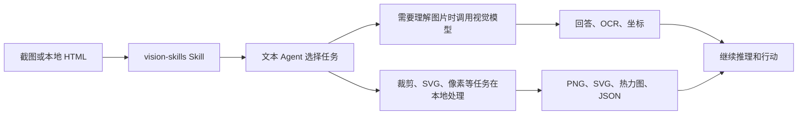

<p align="center">
  
</p>

<div align="center">

# DSH Vision Toolkit

[](LICENSE)
[](cordis.patch.yml)

> **fork：** 本仓库是 [GofMan5/dsh-vision-toolkit](https://github.com/GofMan5/dsh-vision-toolkit)，基于 [Anionex/dsh-vision-toolkit](https://github.com/Anionex/dsh-vision-toolkit)（上游 0.1.46）的分支，把视觉模型变成**可从中继选择、可按模型声明能力**的选择——支持直接从 OpenAI 兼容中继拉取模型列表，并声明每个模型接受图片、视频、音频还是文档。

**更强大的视觉工具箱——给 DeepSeek Harness 里的纯文本模型装上眼睛：图片问答、长图 OCR、前端 UI 还原、GUI 视觉任务，一套视觉工具箱和一个 Skill。**

🚀 粘贴图片，直接提问 ｜ 一行命令安装即用 ｜ 场景丰富

[亮点](#亮点) ｜ [本分支新增](#本分支新增) ｜ [快速开始](#快速开始三步完成) ｜ [工具一览](#工具一览) ｜ [配置与限制](#配置与限制) ｜ [常见问题](#常见问题) ｜ [开发](#开发)

🌐 [English](README.md) ｜ **中文**

</div>

## 本分支新增

- **从中继选择模型。** 在 设置 → 视觉服务 里按 **Load models**：插件用保存的凭证请求 `GET {baseUrl}/models`（兼容 OpenAI 与 Anthropic 两种响应，去重、上限 500 项），把目录渲染成模型下拉；直接使用表单里的值，首次保存前就能用。每个条目标注检测到的输入模态。
- **按模型声明能力矩阵。** 用 **图片 / 视频 / 音频 / 文档** 复选框描述所选视觉模型接受哪些输入。按名称启发式预填（Qwen-Max 家族——`qwen-max`、`qwen3.8-max` 等——和 omni 系列 → 四项全开；`*-vl` 系列 → 图片+视频；Claude → 图片+PDF；Gemini → 四项全开；`qwen-turbo`、`glm-*`、`deepseek-*` 等文本档 → 全关；`qwen-image-*` 等生图模型 → 全关）。与检测默认值相同的开关会被丢弃，存储的映射只保留真正的差异；*重置为检测值* 可恢复启发式。
- **多模态 `vision_glance`。** 除图片外，glance 还接受视频（`.mp4/.webm/.mkv/.mov/.avi/.m4v/.3gp`）、音频（`.mp3/.wav/.m4a/.aac/.ogg/.opus/.flac`）和文档（`.pdf/.docx/.xlsx/.pptx/.doc/.xls/.ppt`），受可配置的 `maxMediaBytes`（默认 32 MiB）约束。输入按协议路由到对应内容块：
  - **OpenAI Chat Completions** — `image_url`、`video_url`（Qwen/DashScope 兼容）、`input_audio`，文档用 `file` 块；
  - **OpenAI Responses** — `input_image` 和 `input_file`；
  - **Anthropic Messages** — 图片块和 PDF `document` 块。

  非图片输入在工具结果里以 `media` 数组呈现（类型、媒体类型、字节数）。
- **能力门禁与可操作的报错。** 模型不接受某个模态时，glance 在**任何字节发出之前**就拒绝——TypeScript 运行时和 Python 客户端（通过 `VISION_MODALITIES` 环境变量）各拦一次——报错直接指向设置里的能力矩阵。切换视觉模型的行为可预期：同一个 `vision_glance` 调用在全多模态 Qwen 上可用，在纯文本模型上大声失败，而不是返回难懂的提供方错误。
- **粘贴媒体确认对话框。** 在当前模型无法原生接收时，粘贴截图、视频、音频或文档会在输入框上方弹出确认卡片——«Прикрепить … для использования плагином Vision Toolkit»，带 «Больше не показывать в этой сессии» 复选框。确认后以工作区路径引用附加文件，不切换模型；静默自动切换到变体路由的机制已移除，变体条目仍可手动选择。
- **视频、音频和文档直接粘贴进输入框**，每个文件上限 100 MiB，引用文本带类型标注，agent 可直接交给 `vision_glance`。
- **分支仓库的应用内更新。** GitHub git 安装支持 **Check for updates** 和一键更新：检查读取仓库默认分支头（commit + 版本），安装固定到解析出的 commit，pnpm 不会再复用过期的浮动解析。npm 安装沿用原有流程；本地/workspace/非 GitHub URL 安装仍需手动。
- **聊天侧媒体如何到达模型。** DSH 宿主附件契约保持 text+image；视频、音频和文档附件以带工作区路径的持久文件句柄到达，纯文本聊天模型看到路径后调用 `vision_glance`——因为*视觉*模型接受该模态，所以现在这条路是通的。

> **外部运行时说明：** 附带的 `agent-vision-toolkit` 快照包含本分支的多模态内容块改动，`UPSTREAM_MANIFEST.json` 已重新生成，因此 `runtime.mode: external` 需要本分支 `vendor/agent-vision-toolkit` 目录的精确导出（干净的上游检出不匹配）。默认的 managed 模式不受影响。

## 亮点

- **粘贴媒体，直接提问。** 在 DSH Web 里粘贴截图、视频、音频或文档，当前模型无法原生接收时会在输入框上方弹出附加确认——«Прикрепить» 把它作为 Vision Toolkit 的工作区路径引用附加，不切换模型；«Больше не показывать в этой сессии» 让本会话后续粘贴不再询问。支持图片的模型保持完全原生的图片粘贴流程。
- **一行命令安装即用。** 安装插件后即可在 **设置 → 视觉工具** 中配置视觉模型并开始使用。
- **不只是看图描述，是获取图中真正需要关注的内容。** 模型不只是生成通用描述，而是围绕“报错在哪里”“按钮在哪”等当前任务提取证据。
- **一套经过实战验证的视觉任务方法论**：项目提供的skill，会告诉 agent 面对不同视觉任务时应该看什么、选择哪个工具、按什么步骤推进，以及最后如何验证结果。

[`agent-vision-toolkit`](https://github.com/Anionex/agent-vision-toolkit) 的视觉能力不只停留在图片描述：Agent 可以读取、定位、裁剪、描摹、还原和验证视觉内容。DSH Vision Toolkit 是这套工具箱面向 DeepSeek Harness 的原生接入，让它进入 Web 和 Headless Profile。

本项目提供两层能力：

1. **视觉工具和 Skill**：让 Agent 知道什么时候该看图、定位、OCR、裁剪、描摹或做像素对比。
2. **DSH 原生接入**：把这些能力放进 Profile、会话、Settings、Artifacts 和 Web 界面。

```sh
dsh plugin --profile web add github:GofMan5/dsh-vision-toolkit
```

**上游工具箱：** [Anionex/agent-vision-toolkit](https://github.com/Anionex/agent-vision-toolkit)

**目录**

- [亮点](#亮点)
- [本分支新增](#本分支新增)
- [最近更新](#最近更新)
- [适合谁用](#适合谁用)
- [实际效果](#实际效果)
- [快速开始：三步完成](#快速开始三步完成)
- [工具一览](#工具一览)
- [配置与限制](#配置与限制)
- [常见问题](#常见问题)
- [开发](#开发)

## 最近更新

- **fork 0.4.1 · 全面评审加固：** 来源围栏完整对齐宿主 `/api` 边界（封堵 DNS rebinding、设置快照 GET 也纳入围栏），registry 更新精确固定版本，`.markdown` 产物可正常交付，透明路由在 DSH 0.2.0-rc 宿主上也能隐藏重复的模型条目（0.2.1–0.4.0 的完整列表见 [CHANGELOG.md](CHANGELOG.md)：桌面端来源修复、附加确认对话框与媒体粘贴、git 应用内更新、变体投票修复、Lexical 输入框粘贴适配）。
- **fork 0.2.0 · 中继模型选择 + 能力矩阵：** 设置可从中继拉取模型目录（`GET /models`），每个模型带检测到的输入模态，按模型覆盖声明接受哪些输入。`vision_glance` 除图片外还接受视频、音频和文档，路由到 `video_url` / `input_audio` / `file`（或 `input_file` / Anthropic document）内容块；不支持的模态在发送任何字节之前以可操作的错误失败。
- **2026-08-19 · 透明变体路由默认开启：** 模型选择器默认只显示每个模型一项并保留原模型名，粘贴图片、历史图片和内置 `read_image` 工具都能直接使用，不再需要手动切换到 `(Vision Toolkit)` 变体；如需恢复显式条目，可在 设置 → 高级设置 → 图片输入 关闭“保留原模型名并自动启用图片能力”。
- **2026-08-16 · Windows Python：** 支持 Microsoft Store Python，解决 Windows 用户首次创建隔离环境失败的问题。
- **2026-08-17 · 视觉升级：** 默认模型切换到 Gemini 3.7 Flash，并修复 Qwen/Gemini 检测框坐标顺序错位的问题。
- **2026-08-16 · 图片粘贴：** 文本模型自动切换到 `(Vision Toolkit)` 变体并保留工作区路径，解决粘贴图片被拦截或后续无法复用的问题。
- **2026-08-16 · 服务稳定性：** 扩大服务容量，减少高峰期出现 `429` 的情况。
- **2026-08-16 · 真实模型测试：** Settings 新增完整图片请求测试，解决 `/models` 可访问却不能证明模型真的会看图的问题。

## 适合谁用

1. 想获得类似多模态模型一样的交互体验：直接粘贴图片，提出要求或疑问
2. 不只是看图问答，想要完成更复杂、更有价值的视觉任务，例如草图变前端页面，图片转html，提取长截图里的聊天信息等等；后续也会不断补充更多的场景。

随附的 `vision-skills` Skill 携带完整的上游 playbook，说明每个工作流何时使用、按什么顺序调用工具，以及如何验证结果：

| 手册 | Agent 学会做什么 |
| --- | --- |
| [读取长截图、聊天记录和滚动页面](assets/skill/references/long-screenshot-ocr.md) | 找到低内容切割带、按顺序 OCR 每个分块、保留聊天发言人/时间戳/引用、只合并重复的重叠部分，并标出有风险的边界供验证 |
| [根据截图或设计重建 UI](assets/skill/references/restore-ui.md) | 优先复用项目组件和素材，再用代码原生 UI、提取的视觉素材、渲染截图和视觉对比来对齐页面或组件 |
| [还原图标、Logo、插画或其他图形](assets/skill/references/restore-graphic.md) | 从源图像提取透明 PNG，或按需重建可编辑/可缩放 SVG，然后验证形状、颜色和 alpha 边缘 |
| [把草图、示意图或白板转成结构化代码](assets/skill/references/restore-structure.md) | 把节点、标签、连接和方向恢复为可编辑的 Mermaid、Graphviz 或其他结构化表示 |
| [通过截图操作 GUI](assets/skill/references/gui.md) | 定位控件、执行一个动作、再次截图，并先验证结果状态再继续 |


## 实际效果

### 在 DSH 里直接粘贴图片提问

<p align="center">
  
</p>

*用户粘贴一张图片，纯文本模型可以切换到对应的* `Vision Toolkit` *变体，并围绕用户的问题读取画面。*

### 从截图到可编辑页面

<p align="center">
  
  
</p>

> 提示词示例：“（使用vision-skills），把这张图片还原成html”

*左：参考截图；右：用 HTML/CSS 还原出的可编辑结果。视觉结果可以继续进入截图和像素对比流程，而不是停在“描述图片”。*

### 从手绘稿到可用界面

<p align="center">
  
  
</p>

*左：手绘参考；右：根据参考还原的可用界面。*

> 提示词示例：“（使用vision-skills），把这张草稿图做成可用的前端页面”

### 快速 UI 还原：先出一版近似稿

<p align="center">
  
  
</p>

> 提示词示例：“（使用vision-skills），把这张图片 快速 还原成html”

*左：原始页面；右：保留主要布局、内容和视觉层级的快速还原稿，允许颜色和图标库近似。快速模式的目标是约三分钟内产出首版截图。*

## 快速开始：三步完成

### 1. 安装

安装**本 fork**。包名为 `@gofman5/dsh-vision-toolkit`（所有者：[GofMan5](https://github.com/GofMan5)），从上游切换时需要同步更新 Profile 的 bundle 列表和 patch 条目名称：

```sh
dsh plugin --profile web add github:GofMan5/dsh-vision-toolkit
```

Headless Profile 也可以安装：

```sh
dsh plugin --profile headless add github:GofMan5/dsh-vision-toolkit
```

使用 **DSH Desktop 桌面版**？桌面版自带 `dsh` 命令行，但有意不写入系统 PATH，请不要在系统终端里执行上面的命令。请从托盘打开 **DSH 终端（Open DSH Terminal）**，在桌面版自己的终端中安装到 Desktop Profile：

```sh
dsh plugin --profile desktop add github:GofMan5/dsh-vision-toolkit
```

安装完成后重启 DSH Desktop。DSH Desktop 2.0.1 内置插件市场的“一键安装”存在已知问题，修复前请优先使用上面的终端命令安装。

完整的桌面版安装、更新与排查步骤见 [DSH Desktop 安装与更新指南](docs/dsh-desktop-install.zh.md)。

### 2. 重启并确认

重启正在运行的 Web Profile，打开 **设置 → 视觉工具**，配置视觉模型，然后运行**测试视觉模型**确认连接。把 API 地址指向 OpenAI 兼容中继后，可点击**加载模型**直接从中继目录选择视觉模型；模型字段下方的能力复选框会显示它接受的输入类型（如果按名称自动检测的结果不对，可以手动调整），然后保存。

首次启动会自动准备隔离运行环境：插件优先使用系统已有的 Python 3.11+；如果系统没有，会自动从国内镜像（`dsh-vision-python-bootstrap-1317715800.cos.ap-guangzhou.myqcloud.com`）下载一个带完整性校验的托管 Python（约 35MB，仅首次需要网络），镜像不可用时自动回退到 GitHub 官方发布源。锁定依赖（Pillow、NumPy、vtracer）会优先从腾讯云 PyPI 镜像（`mirrors.cloud.tencent.com/pypi/simple`）安装，镜像不可用时回退到官方 PyPI。普通安装不需要下载 `agent-vision-toolkit` 源码，也不需要设置本地路径。

### 3. 粘贴图片，直接说你要做什么

在会话中粘贴截图，或把图片放进会话工作区，然后调用 `/vision-skills`。例如：

```text
看看这张截图，告诉我报错原因和最值得先修的地方。
找到右上角的登录按钮，返回原图像素坐标并生成带框预览图。
把这个图标裁出来并转成 SVG。
按照 reference.png 还原页面，每轮截图后做像素对比，直到主要差异消失。
```

## 工具一览

插件提供 10 个可以单独调用、也可以组合使用的视觉工具：

| 工具 | 最适合解决的问题 | 主要结果 |
| --- | --- | --- |
| `vision_glance` | “这张图里发生了什么？” | 针对性回答、描述、OCR、多图比较 |
| `vision_ground` | “我要找的东西在哪？” | 原图像素坐标、可选带框预览 |
| `vision_detect` | “图里有哪些按钮/图标/元素？” | 编号元素清单、坐标、可选预览 |
| `vision_crop` | “把这块区域单独取出来” | PNG 或 JPEG 裁剪图 |
| `vision_trace` | “把这个图形变成可编辑矢量” | SVG |
| `vision_pixel_diff` | “实现和参考图到底差在哪？” | 差异比例、重点区域、热力图、JSON |
| `vision_long_screenshot_ocr` | “读完这张很长的截图” | Markdown、分块图、清单和审计结果 |
| `vision_extract_foreground` | “把主体抠出来” | 透明 PNG |
| `vision_dominant_colors` | “这块区域用了哪些主要颜色？” | 主色板或候选色排序 |
| `vision_html_screenshot` | “按精确视口渲染本地页面，或一次捕获整页” | PNG 和可选的 CSS `pageHeight` |

坐标始终使用原图像素格式 `x1,y1,x2,y2`，因此定位结果可以直接交给裁剪、描摹或后续自动化。

对于长 HTML 文档，传入 `fullPage=true`。请求的宽高仍作为布局视口，生成的 PNG 会覆盖完整文档，并以 CSS 像素返回 `pageHeight`。

## 工作原理

插件把远程图片理解和可重复的本地图片处理放进同一套 Agent 工作流。下面的流程图展示了具体的职责边界。

### 让描述始终围绕当前任务

多数文本模型视觉桥接的做法是让多模态模型生成一段通用描述，再把描述交给文本模型，这等于多了一层必然有损的语义转换。Vision Toolkit 反过来恢复 **Agent 为什么想看这张图**：把用户消息或模型给出的调用原因作为 focus hint（聚焦提示）传给视觉模型，得到的是围绕当前步骤的重点描述——更少 token、更准确、响应更快。

<p align="center">
  
  
</p>

**架构与图片输入行为**



视觉能力来自打包的固定版本 `agent-vision-toolkit`。DSH 插件负责安装、会话级工具暴露、Credential、路径校验、取消、超时、结果文件和 Web 展示。运行时不会在后台拉取上游 `main`。

`vision-skills` Skill（上游原名 `vision-tools`）现在以上游 `SKILL.md` 和全部 5 篇上游 SOP 为明确底稿：
只适配工具名、结构化参数、Artifact 交付、渐进式暴露，以及 DSH 的路径和生命周期边界；
上游的工具选择规则、由粗到细方法和任务流程保持不变。精确的上游 Skill commit、
源文件哈希、适配后哈希和可审查补丁分别记录在 `assets/skill/UPSTREAM.json` 与
`patches/vision-tools-dsh.patch`。

对于明确标记为纯文本的模型，插件会注册 `<模型名> (Vision Toolkit)` 变体。默认情况下，在 DSH Web 粘贴图片时会自动切换到该变体，并把图片路径与带当前任务重点的视觉描述一起交给模型。

## 配置与限制

### 配置视觉模型

在 **设置 → 视觉工具** 中配置视觉模型提供方，并把 API Key 保存为 DSH Credential。Settings 只保存 Credential 引用，不会回显密钥。

也可以在 Profile patch 中配置：

```yaml
- id: vision-toolkit
  config:
    provider:
      baseUrl: https://api.example.com/v1
      credential: MY_VISION_KEY
      model: your-vision-model
      protocol: openai
```

支持 OpenAI Chat Completions 兼容端点、OpenAI Responses 和 Anthropic Messages。已有配置仍默认使用 Chat Completions。若要使用兼容 Responses 的端点，请设置 `protocol: responses`；插件会在 API 地址后拼接 `/responses`。可选的 `reasoningEffort` 仅随 Responses 请求发送：

```yaml
      protocol: responses
      reasoningEffort: medium
```

`reasoningEffort` 留空时使用模型或代理的默认值。常见值包括 `none`、`minimal`、`low`、`medium`、`high` 和 `xhigh`；为兼容第三方代理和未来扩展，该字段也接受由字母、数字、`.`、`_`、`-` 组成且不超过 64 位的提供方自定义值。实际支持范围与计费由模型或代理决定；较高强度可能增加推理 token、延迟和费用。Responses 请求会设置 `store: false`，但该标记不能替代核查服务商自己的数据保留政策。Web Settings 页面覆盖视觉服务、运行时、超时、图片限制和图片输入变体的全部配置。
Profile patch 还可以通过 `provider.headers` 配置非秘密的部署元数据。需要按会话路由的网关可在 `provider.sessionHeaders` 中列出一个或多个运行时生成的请求头；例如 OpenCode Zen 要求 `x-opencode-session`：

```yaml
- id: vision-toolkit
  config:
    provider:
      headers:
        x-tenant: acme
      sessionHeaders:
        - x-opencode-session
```

静态请求头是保存在 Settings 中的普通明文，不是 Credential。不要在 `provider.headers` 中填写 API Key、Bearer Token、Cookie 或其他秘密；视觉 API Key 仍应使用 `provider.credential`。插件会拒绝客户端自有的鉴权头和 HTTP 路由/请求帧控制头、大小写不敏感的重复项、两个字段间的冲突、非法名称或值、合计超过 32 项、名称超过 128 字节、值超过 4096 字节，或总量超过 16384 字节的配置。

每个会话请求头都会获得 HMAC-SHA256（带密钥的不可逆摘要）的前 32 位十六进制值，密钥在 DSH 进程启动时随机生成。同一进程内，相同 operation identity（一次调用采用的会话身份）得到稳定值；重启后会轮换。有 Session 的调用只把 Session id 作为内部 HMAC 输入；确实没有 Session 时才回退到 `workspace:<绝对路径>`，原始 Session id 和 workspace 路径都不会发送。同一次 Settings 健康检查的 `GET /models` 与真实模型请求共用派生值。请求头只注入配置 provider 的同源 URL 且路径必须位于其 base path 下。两个字段均为空时，不创建额外请求头环境变量，provider 的网络请求头语义保持原样。

高级设置中的 **默认保存目录** 可以把产物、粘贴图片和缓存放到 `/tmp/dsh-vision-toolkit` 等 POSIX 绝对共享根目录下；插件会为当前用户和工作区创建权限为 0700 的私有子目录。留空时继续使用工作区内原有的 `.dsh-vision-toolkit` 目录。Windows 目前会拒绝配置共享根目录，因为插件尚不能安全校验其所有权和访问控制列表。

配置的保存目录变更后，插件会把之前验证过的根目录保留为只读输入位置。Web Profile 会把这段历史保存在插件自有的 `vision_toolkit_storage` storage-domain sidecar 中；即使当前 Settings 提供方只读，Profile 重启后原有粘贴图片路径仍可继续使用。使用配置共享存储的自定义 Profile 应组合 `@deepseek-ai/dsh-storage-domain`。

如果受信任的内部端点使用自签证书或 MITM 代理，可在启动 DSH 进程时设置 `VISION_SSL_VERIFY=0`。插件会把该值传入隔离的 Python 运行环境；未设置或使用其他值时仍默认校验证书。还支持大小写不敏感的假值 `false`、`off`、`no`、`none` 和 `disabled`。

### 配置 Python 运行时

大多数用户无需配置 Python 运行时：插件会优先使用系统 Python 3.11+，找不到时自动从国内镜像下载固定版本的托管 Python；国内镜像不可用时回退到 GitHub 官方发布源。

需要覆盖 `runtime.python`、使用 `runtime.mode: external`、验证运行时，或允许读取其他目录时，请参阅 [Python 运行时配置](docs/python-runtime.zh.md)。

## 常见问题

| 问题 | 处理方式 |
| --- | --- |
| 视觉模型测试失败：`Vision API returned an incompatible response structure` | 通常是 API 地址少了路径前缀。LM Studio、Ollama 等本地 OpenAI 兼容服务需填写 `http://127.0.0.1:1234/v1`（带 `/v1`）；OpenAI Chat Completions 会拼接 `/chat/completions`，OpenAI Responses 会拼接 `/responses`，只填端口号可能命中未知端点 |
| 粘贴图片后仍提示模型不支持图片 | 重启 Web Profile 并刷新页面后重新粘贴：输入框上方应出现附加确认卡片，确认后文件会作为 Vision Toolkit 引用附加；也可以把图片先放进会话工作区，再调用 `/vision-skills` |
| 视觉服务提示 429 | 按错误中的 `Retry-After` 等待后重试；如果需要稳定高额度，切换到自己的视觉端点 |
| 图片过大或像素超限 | 先裁剪或缩放图片；错误会明确显示是字节还是像素限制 |
| 自定义 Credential 缺失 | 在 **设置 → 视觉工具** 填写 API Key，并确认 Credential 名称与配置一致 |
| OpenCode Zen 返回 `400 MissingSessionID` | 在 Profile patch 的 `provider.sessionHeaders` 中加入 `x-opencode-session`，然后重启 Profile；不要把 Session id 或 API Key 写进 `provider.headers` |
| 首次运行时准备失败 | 自动下载托管 Python 需要网络和磁盘权限（默认先走国内镜像，失败时回退 GitHub）；失败时检查网络或包缓存，也可以安装 Python 3.11+ 或在 Settings 中配置 `runtime.python`，然后重新测试 |
| 找不到 Chrome | 安装 Chrome、Chromium 或 Edge；只有 HTML 截图不可用，其他工具不受影响 |
| DSH Desktop 提示找不到 `dsh` 命令，或内置插件市场安装失败 | 从托盘打开 **DSH 终端**，运行 `dsh plugin --profile desktop add github:GofMan5/dsh-vision-toolkit`，再重启 DSH Desktop。桌面版 2.0.1 的内置市场存在已知安装问题，当前请优先使用终端安装 |
| 产物无法预览 | 使用“打开文件”或结果中的工作区路径；预览 URL 只在 Web 路由可用时存在 |

## FAQ

**视觉模型会怎样影响成本？**

每次检查都是一条独立的多模态请求，只携带必要意图和图片，调用之间不会累积上下文。实际费用取决于服务商、图片、模型，以及 Responses 的 `reasoningEffort`；较高强度可能消耗更多推理 token 并增加延迟。留空可使用提供方默认值；若更看重可预测的本地成本，也可以使用本地部署的小型多模态侧模型（例如 Gemma 4 或 Qwen 3.5/3.6 系列）。

## 开发

- 贡献前请阅读 [CONTRIBUTING.md](CONTRIBUTING.md)。
- Bug、功能建议和使用问题请提交到 [GitHub Issues](https://github.com/GofMan5/dsh-vision-toolkit/issues)。
- 安全漏洞请按 [SECURITY.md](SECURITY.md) 私下报告。
- 版本变化见 [CHANGELOG.md](CHANGELOG.md)。
- 通用视觉工具、跨 Agent 接入和视觉任务方法论请访问上游 [agent-vision-toolkit](https://github.com/Anionex/agent-vision-toolkit)。

[`agent-vision-toolkit`](https://github.com/Anionex/agent-vision-toolkit) 由 [Anionex](https://github.com/Anionex) 创建；本 fork 维护它面向 DeepSeek Harness 的接入。

## 许可证

插件采用 [MIT License](LICENSE)。打包的上游快照保留其原始 MIT 许可证，见 [`vendor/agent-vision-toolkit/LICENSE`](vendor/agent-vision-toolkit/LICENSE)。
